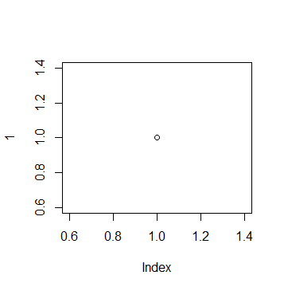

```{r pacotes, include=FALSE}
if(!require("vegan")) install.packages("vegan") # se esse pacote nao estiver instalado, instale!
if(!require("knitr")) install.packages("knitr")
```


# Resumo

# Introdução

Primeira frase.

<!-- codigo para inserir uma figura -->
 


As *rosas* de **cordona** não brotam no inverno
H~2~O 
nome^2^

- Item 1
    - Item 1.1
    
    
- Item 2


+ Item 3


1. Item


2. Item
  - Item não sei o número


# Materiais e Métodos

## Coleta de dados

## Análise de dados

# Resultados

A tabela *mtcars* tem:

`r nrow(mtcars)` linhas

`r ncol(mtcars)` colunas 


<!-- ###  COLOCANDO TABELA  -->
<!-- ### -->
```{r,echo=FALSE,eval=TRUE}
data (mtcars)
kable(mtcars)
```


A Cerquinha abaixo nao mostra o codigo e nem o resultado dele
```{r cerquinha-do-plot,echo=FALSE,eval=FALSE}
plot(1)
```
A Cerquinha abaixo mostra o codigo, mas nao mostra o resultado dele
```{r, echo=TRUE,eval=FALSE}
plot(1)
```
A Cerquinha abaixo mostra o codigo e o resultado dele
```{r, echo=TRUE,eval=TRUE}
plot(1)
```

A Cerquinha abaixo nao mostra o codigo, mas mostra o resultado dele
```{r, echo=FALSE,eval=TRUE}
plot(1)
```

Analise de dados
```{r, echo=FALSE,eval=TRUE,results='markup'}
data("mtcars")

summary(lm(mpg~ carb, mtcars))
```


# Discussão
Cerquinha com a figura e a legenda
```{r,echo=FALSE,eval=TRUE,fig.cap="**Fig. 1** Imagem do plot da figura 1"}
plot(1)
```

<!-- Como citar alguem no Rmarkdown -->
Estou citando a Jasci [@Bortolini2016].

<!-- Citacao direta  -->
Estou citando a  @Bortolini2016, isso pode acontecer.

<!-- Citacao com mais de um autor -->
Estou citando varias pessoas que fizeram isso[*i.e*; @Izaguirre2012;@Bortolini2016; @Santana2016 ]

# Referência
<!-- https://github.com/citation-style-language/styles  -->


